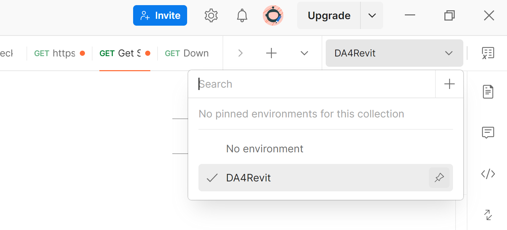
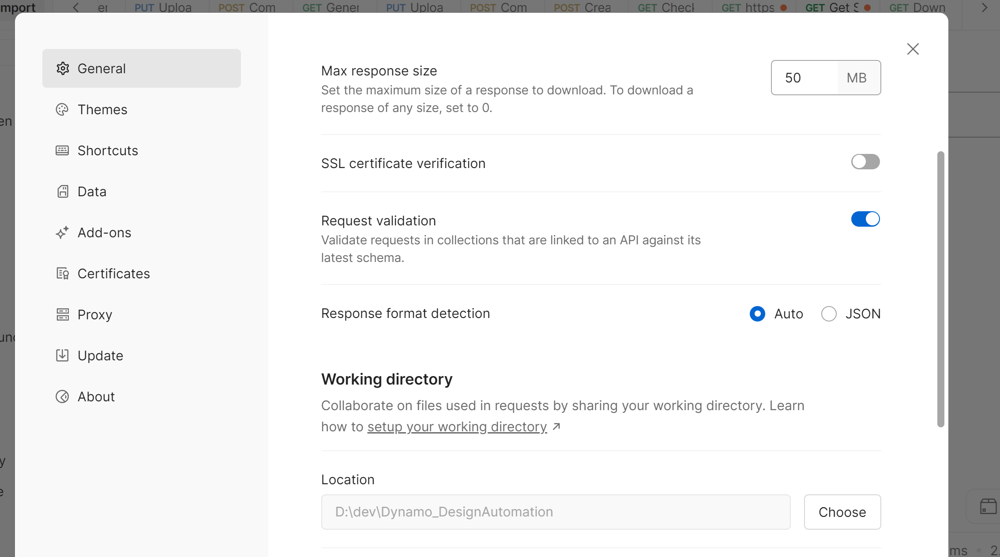
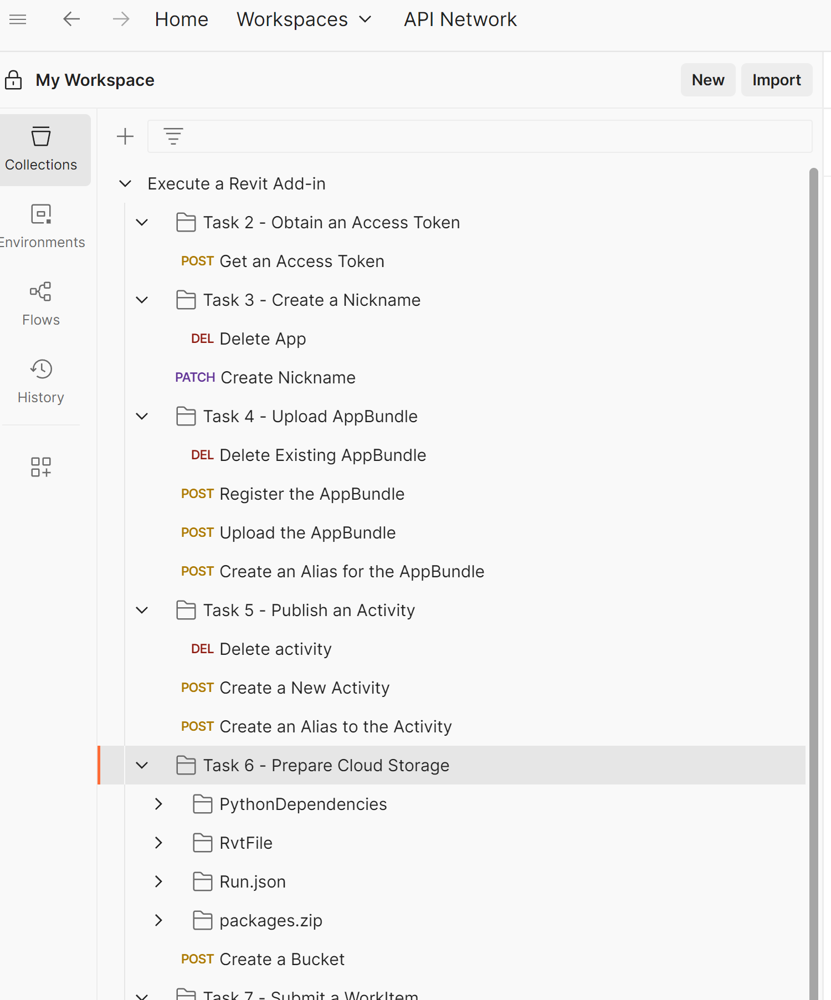
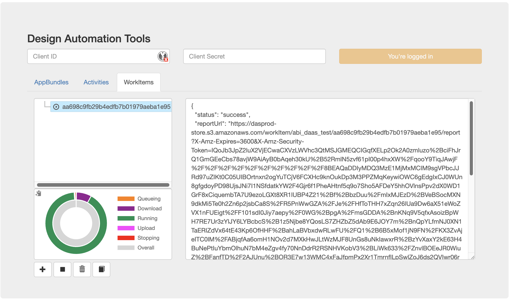
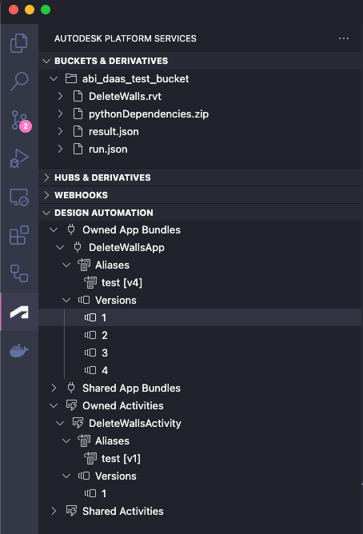

# DynamoRevit for Design Automation

This repo contains supporting files, scripts and documentation that can help streamline onboarding and running Dynamo graphs in Design automation for Revit.

## Overview of the standard design automation process

- Create an `AppBundle`, a collection of dlls that represents a revit cloud addin.
- Publish an `Activity`, metadata that describes some of the characteristics of the job that will run your AppBundle, like the inputs and outputs.
- Upload files to `Cloud Storage`, the files that will be referenced by the Activity.
- Submit a `WorkItem`, a job.
- Download the `Results`.

[Revit add-in on Design Automation Walkthrough](https://aps.autodesk.com/en/docs/design-automation/v3/tutorials/revit/)

## Prerequisites

- Go to [APS Developer portal](https://aps.autodesk.com/).
- Create an app.
- Grab the Client ID and Client Secret.
- Clone this repo to your local system.
- To use postman, download and install it from [here](https://www.postman.com/downloads/).
- There are 2 files you need to import in the postman app, a [collection](./postman/Execute%20a%20Dynamo%20Revit%20Add-in.postman_collection) and an [environment file](./postman/DA4Revit.postman_environment.json).
- Set the current environment to the loaded DA4Revit 
- Set the work directory in postman to the location where you cloned this repo locally 

## Tasks

For general instructions see the [Walkthrough](https://aps.autodesk.com/en/docs/design-automation/v3/tutorials/revit/).

Below there are instructions on how to use postman to run design automation work items.
Switch to the `Execute a Dynamo Revit Add-in` collection and go through the Tasks one by one.
Some of the tasks also contain `Delete` commands which can be helpful if you want a clean slate.


- Task 1 - [Convert Revit Add-in](https://aps.autodesk.com/en/docs/design-automation/v3/tutorials/revit/step1-convert-addin/).
  - The addin is already created and you find it at [DynamoRevitDA.zip](./da_files/DynamoRevitDA.zip).
  - If you need to use python nodes please also see [pythonDependencies.zip](./da_files/pythonDependencies.zip).
  - If you need to run dynamo packages, you can zip up the packages in a single zipped with the name `packages.zip`. See this example [packages.zip](./da_files/packages.zip).
- Task 2 – [Obtain an Access Token](https://aps.autodesk.com/en/docs/design-automation/v3/tutorials/revit/step2-create-forge-app/).
  - Run the `Get an Access Token` request in the `Task 2 - Obtain an Access Token` section of the postman collection.
- Task 3 – [Create a Nickname](https://aps.autodesk.com/en/docs/design-automation/v3/tutorials/revit/step3-create-nickname/).
  - Run the `Create Nickname` request in the `Task 3 - Create a Nickname` section of the postman collection.
- Task 4 – [Upload the AppBundle](https://aps.autodesk.com/en/docs/design-automation/v3/tutorials/revit/step4-publish-appbundle/).
  - Register the AppBundle by running `Register the AppBundle` request.
  - Upload the AppBundle by running the `Upload the AppBundle` request.
  - Create an alias for the AppBundle by running the `Create an Alias for the AppBundle` request.
- Task 5 – [Publish an Activity](https://aps.autodesk.com/en/docs/design-automation/v3/tutorials/revit/step5-publish-activity/).
  - Create a new Activity by running the `Create a New Activity` request. 
  - Create an alias for the Activity by running the `Create an Alias to the Activity` request.
  
  Notes: 
    The activity must use specific parameters to be compatible with the dynamo AppBundle. 
    - parameters - the DynamoAddin requires the following parameters (but not limited to):
      - An `.rvt` file (get parameter) on which to operate (will be automatically opened as the current revit model). You can use [DeleteWalls.rvt](./DeleteWalls.rvt) as an example.
      - A `run.json` file (get parameter). This must respect the Player specifications for a GraphRunRequest. You can use [run.json](./da_files/run.json) as an example.
      - A `pythonDependencies.zip` (get parameter). This zip can be downloaded from [pythonDependencies.zip](./da_files/pythonDependencies.zip). It contains the Python.Included.dll and Python.ScyPy.dll normally included with Dynamo out of the box. These must be uploaded separately from Dynamo because they are too large to bundle up with the DynamoAddin (DesignAutomation has a size limit on the AppBundles you can upload set at 100 MB).
      - A `result.json` (put parameter) can be included. This file will contain the graph run output (as produced by Dynamo Player).
      - A `result.rvt` (put parameter) can be included in order to download it. This file will contain the provided revit model after the dynamo run.

    Here is an example of an activity:

    ```shell
    curl -X POST 'https://developer.api.autodesk.com/da/us-east/v3/activities' \
      -H 'Content-Type: application/json' \
      -H 'Authorization: Bearer <ACCESS_TOKEN>' \
      -d '{
            "id": "DeleteWallsActivity13",
            "commandLine": [ "$(engine.path)\\\\revitcoreconsole.exe /i \"$(args[rvtFile].path)\" /al \"$(appbundles[DynamoDATest].path)\"" ],
            "parameters": {
             "rvtFile": {
                "zip": false,
                "ondemand": false,
                "verb": "get",
                "description": "Input Revit model",
                "required": true,
                "localName": "$(rvtFile)"
              },
             "runRequest": {
                "zip": false,
                "ondemand": false,
                "verb": "get",
                "description": "Input Revit model",
                "required": false,
                "localName": "run.json"
              },
              "pythonLibs": {
                "zip": true,
                "ondemand": false,
                "verb": "get",
                "description": "Python libs",
                "required": false,
                "localName": "pythonDependencies"
              },
              "dynResult": {
                "zip": false,
                "ondemand": false,
                "verb": "put",
                "description": "Results",
                "required": false,
                "localName": "result.json"
              },
              "rvtResult": {
                "zip": false,
                "ondemand": false,
                "verb": "put",
                "description": "Results",
                "required": false,
                "localName": "result.rvt"
              }
            },
            "engine": "Autodesk.Revit+2026",
            "appbundles": [ "DynamoDATest.DynamoDATest+test" ],
            "description": "Deletes walls from Revit file."
          }'
    ```

- Task 6 – [Prepare Cloud Storage](https://aps.autodesk.com/en/docs/design-automation/v3/tutorials/revit/step6-prepare-cloud-storage/).
  - If not already created, run the `Create a Bucket` request to create a bucket for all storage items.
  - The get parameters described at the previous step must be uploaded as individual files. Run all the requests in the `Task 6 - Prepare cloud storage` folder.
    - The `.rvt` file - run the tasks inside the `RvtFile` subfolder.
    - The `run.json` file - run the tasks inside the `RvtFile` subfolder.
    - The `run.dyn` file - run the tasks inside the `RvtFile` subfolder.
    - The `pythonpythonDependencies.zip` - run the tasks inside the `RvtFile` subfolder.
    - The `packages.zip` - run the tasks inside the `packages.zip` subfolder.

- Task 7 - [Submit a WorkItem](https://aps.autodesk.com/en/docs/design-automation/v3/tutorials/revit/step7-post-workitem/).
  - Submit a workitem by running the `Create a  WorkItem` request.
  - Check the work status by running the `Check Status of a  WorkItem` request.

  Here is an example of an activity:

  ```shell
    curl -X POST 'https://developer.api.autodesk.com/da/us-east/v3/workitems' \
      -H 'Content-Type: application/json' \
      -H 'Authorization: Bearer <ACCESS_TOKEN>' \
      -d '{
            "activityId": "DynamoDATest.DeleteWallsActivity7+test",
            "arguments": {
              "rvtFile": {
                "url": "urn:adsk.objects:os.object:dynamodatestbucket/DeleteWalls.rvt",
                  "verb": "get",
                  "headers": {
                    "Authorization": "Bearer <ACCESS_TOKEN>"
                  }
              },
              "runRequest": {
                "url": "urn:adsk.objects:os.object:dynamodatestbucket/run.json",
                  "verb": "get",
                  "headers": {
                    "Authorization": "Bearer <ACCESS_TOKEN>"
                  }
              },
              "pythonLibs": {
                "url": "urn:adsk.objects:os.object:dynamodatestbucket/da_files/pythonDependencies.zip",
                  "verb": "get",
                  "headers": {
                    "Authorization": "Bearer <ACCESS_TOKEN>"
                  }
              },
              "dynResult": {
                  "url": `urn:adsk.objects:os.object:dynamodatestbucket/result.json`,
                  "verb": "put",
                  "headers": {
                      "Authorization": `Bearer <ACCESS_TOKEN>`
                  }
              },
              "rvtResult": {
                  "url": `urn:adsk.objects:os.object:dynamodatestbucket/result.rvt`,
                  "verb": "put",
                  "headers": {
                      "Authorization": `Bearer <ACCESS_TOKEN>`
                  }
              }
            }
          }'
  ```

- Task 8 - [Download the Results](https://aps.autodesk.com/en/docs/design-automation/v3/tutorials/revit/step8-download-results/) 
  - Run the `Get S3 Download URL for Resulting RVT file` and `Download Resulting RVT File` tasks to download the revit file.
  - Run the `Get S3 Download URL for result.json` and `Download Result.json` to download the dynamo output. The result will look like [this](./examples/result.json)

## Scripts

You can perform above tasks using the bash scripts in this repository.

> [!IMPORTANT]
> Copy [`.env.example`](.env.example) and save it as `.env` and fill in the `CLIENT_ID` and `CLIENT_SECRET` and update other fields as needed.

### How to run bash scripts

> [!IMPORTANT]
>
> - Install [jq](https://jqlang.org/).
> - Prepare environment variables.
>   - You can use [direnv](https://direnv.net/) to load values from `.env` as environment variables.
>   - Alternatively, you can copy use  an `.envrc` file. [`.envrc.example`](.envrc.example) and save it as `.envrc` and source it `source .envrc` to load the environment variables. 

You use these [bash scripts](/scripts/) to perform all of the tasks listed above. e.g `./scripts/get_appbundles.sh`.

- Task 1 - [Convert Revit Add-in](https://aps.autodesk.com/en/docs/design-automation/v3/tutorials/revit/step1-convert-addin/)
  - Download addin - `./scripts/download_artifacts.sh`
- Task 2 – [Obtain an Access Token](https://aps.autodesk.com/en/docs/design-automation/v3/tutorials/revit/step2-create-forge-app/)
  - Get access token - `./scripts/get_access_token.sh`
- Task 3 – [Create a Nickname](https://aps.autodesk.com/en/docs/design-automation/v3/tutorials/revit/step3-create-nickname/)
  - Create nickname - `./scripts/create_nickname.sh <nickname>`
- Task 4 – [Upload the AppBundle](https://aps.autodesk.com/en/docs/design-automation/v3/tutorials/revit/step4-publish-appbundle/)
  - Register the AppBundle - `./scripts/register_appbundle.sh <app_id>` => output `<appbundle_json>`
  - Upload the AppBundle. Use [DynamoRevitDA.zip](./da_files/DynamoRevitDA.zip). - `./scripts/upload_appbundle.sh <appbundle_json>`.
  - Create an alias for the AppBundle. - `./scripts/create_appbuldle_alias.sh <app_id> <app_alias>`
  - Create a new version of the AppBundle. - `./scripts/update_appbundle.sh <app_id>`
  - Point the alias to the new version of the AppBundle. - `./scripts/update_appbundle_alias.sh <app_id> <app_alias> <app_version>`
- Task 5 – [Publish an Activity](https://aps.autodesk.com/en/docs/design-automation/v3/tutorials/revit/step5-publish-activity/)
  - Create activity - `./scripts/create_activity.sh <nickname> <app_id> <app_alias> <activity_id>` => output `activity.json`
  - Create activity alias - `./scripts/create_activity_alias.sh <activity_id> <activity_alias>`
  - Download report. Report will look like [this](./examples/report.txt) - `./scripts/download_report.sh`
- Task 6 – [Prepare Cloud Storage](https://aps.autodesk.com/en/docs/design-automation/v3/tutorials/revit/step6-prepare-cloud-storage/)
  - Create bucket - `./scripts/create_bucket.sh <bucket_key>` => output `bucket.json`
  - Create signed upload url - `./scripts/create_signed_upload_url.sh <bucket_key> <object_key>` => output `<object_key>_upload.json`
  - Upload file to bucket - `./scripts/upload_to_bucket.sh <upload_json> <file>`
  - Complete upload - `./scripts/complete_upload.sh bucket_key> <object_key> <upload_json>`

  The get parameters described at the previous step must be uploaded as individual files:
  - The `.rvt` file
  - The `run.json` file
  - The `run.dyn` file
  - The `pythonpythonDependencies.zip`

- Task 7 - [Submit a WorkItem](https://aps.autodesk.com/en/docs/design-automation/v3/tutorials/revit/step7-post-workitem/)
  - Create workitem - `./scripts/create_workitem.sh <nickname> <activity_id> <activity_alias> <bucket_key>` => output `workitem_<timestamp>.json`
  - Get workitem status - `./scripts/get_workitem_status.sh <workitem_id>` => output `workitem_<workitem_id>.json`
  - Get report - `./scripts/get_report.sh <workitem_status_json>` => output `report.txt`

- Task 8 - [Download the Results](https://aps.autodesk.com/en/docs/design-automation/v3/tutorials/revit/step8-download-results/)
  - Create signed download url - `./scripts/create_signed_download_url.sh <bucket_key> <object_key>` => output `<object_key>_download.json`
  - Download result - `./scripts/download_result.sh <download_json> <file>`

  Result will look like [this](./examples/result.json)


### Run DA with javascript: design_automation.js

> [!IMPORTANT]
> Install [nodejs](https://nodejs.org/en/download).
> Run `npm install`

You can also use this [js script](./design_automation.js) for all the update tasks once the resources are created. e.g `node design_automation.js all`.

- Run `node design_automation.js all` to set up all tasks (from 2 to 8)
- You can also run individual tasks, by specifying one or more of the following arguments:
  - `nick`- Creates a nickname
  - `bundle`- Creates an app bundle
  - `activity` - Creates an activity
  - `rvt` - Uploads the revit file
  - `python` - Uploads the pythonDependencies.zip
  - `run` - Uploads the run.json request
  - `work` - Creates and submits a WorkItem request
  - `result` - Polls for results (ands saves the results locally log.txt, result.json and result.rvt)

## Useful tools

[Design Automation Tools](https://da-manager.autodesk.io/) portal.
> [!TIP]
> You can also see your AppBundles, Activities and WorkItems in [Design Automation Tools](https://da-manager.autodesk.io/) portal.
> 

[Autodesk Platform Services](https://marketplace.visualstudio.com/items?itemName=petrbroz.vscode-forge-tools) vscode extension.
> [!TIP]
> You can browse your APS resources in VSCode with [Autodesk Platform Services](https://marketplace.visualstudio.com/items?itemName=petrbroz.vscode-forge-tools) extension.
> 